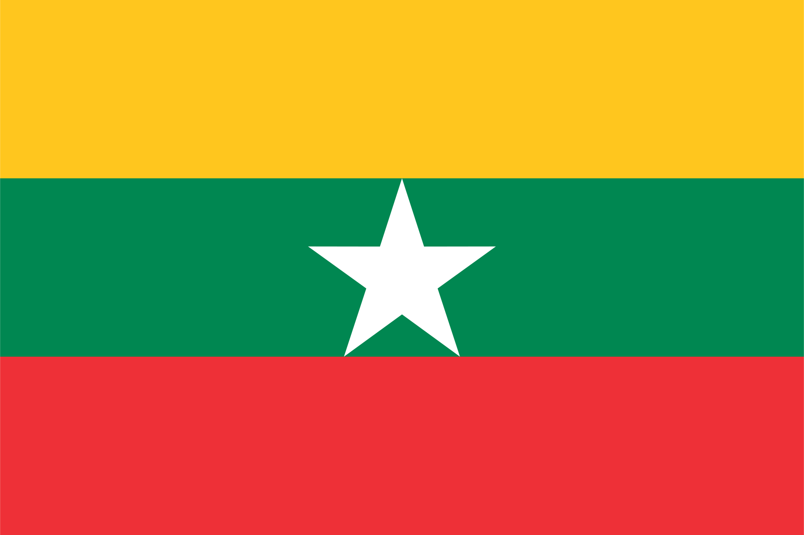

# ai-flags

This is code for the ai-flags website and a collection of experiments and tools for working with
SVG, flags and AI.

## Get Started

### Prerequisites

- [Deno](https://deno.land/)
- [Node.js](https://nodejs.org/en/) (to use eslint while developing)

### Installation

```bash
git clone https://github.com/pumpncode/ai-flags.git
cd ai-flags
npm install
```

### Usage

#### Start the web app

```bash
deno task start
```

#### Generate flags

```bash
deno task generate ${setup name}
```

## Motivation

I got the idea for this project back when the first usable text-to-image generators were released to the public and the internet went crazy over generated images of astronauts riding horses or celebrities in unexpected settings. As I delved deeper into the world of these tools, I realized that they were mostly trained on photos of people, animals, landscapes, buildings and paintings - everything that resembles reality or is somewhat of a caricature of it. Unfortunately, these tools struggled to generate even simple, straight, one-colored lines, let alone legible letters or short words. It's ironic that creating an image of [the Eiffel Tower but red and in the style of The Starry Night](https://huggingface.co/spaces/stabilityai/stable-diffusion/discussions/13955) is still easier for these models than generating a [basic shape](https://huggingface.co/spaces/stabilityai/stable-diffusion/discussions/13959) or [word](https://huggingface.co/spaces/stabilityai/stable-diffusion/discussions/13956). Initially, I was perplexed by this limitation, considering the internet is replete with images of straight lines, colored rectangles, words and flat logos. However, it's plausible that specific origins and types of images were filtered out of the datasets to make the models easier to prompt, ensuring better results for most users and usecases. Without such filtering, simply typing "cat" may not be sufficient to generate a photo of a cat, one might need to write "photo of a cat."

Considering all of that, it shouldn't come as a surprise that generators like Stable Diffusion or Midjourney are really terrible at generating flat images of flags. To be honest, "really terrible" here is an understatement, because regardless of how you structure your prompt, neither the simple ["myanmar flag"](https://huggingface.co/spaces/stabilityai/stable-diffusion/discussions/13961), nor the more verbose ["flag of myanmar, flat, svg"](https://huggingface.co/spaces/stabilityai/stable-diffusion/discussions/13960), nor the attempt at telling the AI where specifically the reference image is, like ["flat image of the flag of myanmar, svg, high res, wikimedia commons"](https://huggingface.co/spaces/stabilityai/stable-diffusion/discussions/13962) produce acceptable results. A literal 4 year old could do better after hearing a short description of the flag. I mean, not even ["a horizontal tricolour flag of yellow, green, and red charged with a five-pointed white star in the centre of the field, flat, svg, flag of myanmar"](https://huggingface.co/spaces/stabilityai/stable-diffusion/discussions/13963) does the trick.

|  |  |  |  |
| --- | --- | --- | --- |

At this point I gave up on the idea that models like these were capable of generating flags at all. I know it's controversial to call something "an understanding" of things in this context, but while you could argue that these models have somewhat of an understanding of how faces, animals, structures or buildings should look like and what's possible to change about them creatively, without destroying their fundamental structure, they simply have no feeling for basic shapes or sharp, clean edges. They are spitting out pixels based on the words you give them, and it seems like it's just the format of the output that is the actual problem here. I thought, what if you could somehow ask them to tell you what they **think** they are doing as opposed to what they are actually doing? What if you could split the whole process into two tasks, one for figuring out how a flag should look like and one to create an image of it? So I did.

### Text to Text to Image

Separating these two tasks was the first step in the right direction. No longer was it completely unclear if existing AI tools just don't know what a flag looks like or if they are too dumb to visualize it. Spoiler alert: It's a bit of both.

In this split up process, we can define three "roles":

- The questioner: This can only be a human, although this role could seek AI assistance on how to phrase their question. The questioner asks the **vexillologist** to describe a flag.
- The vexillologist: This can be either a human or an AI. The vexillologist describes a flag to the **vexillographer** as accurate as possible and asks them to create an image of it.
- The vexillographer: This can be either a human or an AI as well. The vexillographer takes the description of the flag and creates an image of it.

In the experiments above, the last two tasks were both done by AI, but to really find out where AI struggles the most and why, we as humans can jump in and play one of the two roles while the AI plays the other one, or at least inspect the two roles. This can be done in a few different ways using a few different tools of course, but we also shouldn't underestimate the importance of the first role, the questioner. In fact, the way the questioner frames the question can have a significant impact on the AI's ability to provide accurate and relevant responses. As humans, we have the ability to analyze and understand the context of a question and ask follow-up questions to clarify any ambiguities. This is something that AI tools like ChatGPT still struggles with, as it often relies on pre-existing patterns and data sets to generate responses. Especially ChatGPT can sometimes exhibit a tendency to rather provide wrong answers without seeking clarification or additional information instead of telling that it doesn't know or doesn't have enough information.

The experiments described below involve ChatGPT exclusively in the designated roles, but it should be noted that there are numerous alternative setups that could be employed. Specifically, when it comes to generating SVG markup, one might argue that a specialized text-to-code model like code-davinci-002 or GitHub Copilot would be better suited for the task.

It's also noted that whenever I speak of a "human" slipping into one of the roles, this of course can also just mean text written assisted by AI or the internet or code. For example, if we are the **vexillologist** and are asked to describe a flag of a country accurately, we can just look it up on Wikipedia and copy the description written by another human, not just using content we came up with. Although even Wikipedia isn't accurate enough in some cases, relying on images of construction sheets or too general descriptions a vexillologist might understand but a non-vexillologist might struggle with. However, to keep comparisons "fair", so to speak, I will always try to stay in the scope of the conversation without a lot of outside help, sometimes even actively ignoring my own knowledge of a flag, just to see how far AI can get on its own, since this is basically the whole reason for this project and the main point of interest here. Also keep in mind the randomness of ChatGPT. The selected examples below are just the first results I got, if the goal was to find the best result, asking the same thing multiple times and picking the best answer would be necessary.

#### Human Text to AI Text to Human Image

Here we ask the AI to describe a flag, but then create the image of it ourselves. While ChatGPT does a great job of describing flags **roughly**, asking to get more specific can get wrong really fast. Also, in typical snarky ChatGPT fashion, it often provides additional information about the symbolism of a flag, which in our case just adds irrelevant noise.

I actually had this same idea of prompting language models for flag descriptions and then creating images myself based on the results back in November 2021, before text-to-image models were as well-known and usable as they are now, but never got around to publishing my work. I still have the PSD files on my drive, so I may upload them as PNGs some day, either here on GitHub or on reddit.

Anyways, let's see how ChatGPT does today:

---

Us (**questioner**):
> describe the flag of myanmar

ChatGPT (**vexillologist**):

> The flag of Myanmar (formerly known as Burma) features a design of three horizontal stripes in yellow, green, and red colors, with a white five-pointed star in the center. The yellow stripe represents solidarity and the union of the people, the green stripe represents peace, tranquility, and lush greenery of the country, and the red stripe represents courage, bravery, and determination of the people.
>
> The white star in the center of the flag has five points, each point represents one of the five main ethnic groups of Myanmar - Kachin, Kayah, Karen, Chin, and Shan - and symbolizes the unity and solidarity of these groups.
>
> The flag of Myanmar was adopted on January 3, 1974, to replace the previous flag, which had a similar design but with different colors and a cogwheel in the center to represent industry and workers. The current design was chosen to reflect the country's natural beauty and ethnic diversity.

Us (**questioner**):
> describe the flag of myanmar, tell me the aspect ratio, the exact colors and how to construct it

ChatGPT (**vexillologist**):

> The flag of Myanmar, also known as the national flag of the Republic of the Union of Myanmar, has the following specifications:
>
> Aspect Ratio: 2:3
>
> Colors: Yellow (#FFC61E), Green (#008751), Red (#EE3037), and White (#FFFFFF)
>
> To construct the flag of Myanmar, you will need a rectangular piece of fabric with a width to height ratio of 2:3. Divide the flag horizontally into three equal parts, and then color each section in the following order from top to bottom:
>
> Yellow (top section)
>
> Green (middle section)
>
> Red (bottom section)
>
> The white five-pointed star should be placed in the middle of the flag, with each of its points touching the edges of the yellow, green, and red sections. The star should be centered horizontally and vertically within the flag.
>
> To ensure accurate colors, it is recommended to use the Pantone color matching system or a similar color reference guide when creating or reproducing the flag.

---

While the ratio is correct here (which could be a coincidence, considering that 2:3 is very common), the color codes are completely made up. It's also unclear why ChatGPT assumes we want to physically construct the flag and suggests getting a piece of fabric. The description on how to place the star on the flag is also inaccurate at best and just wrong at worst, the white star on the official flag does not "touch" the edge of any stripe, its height is actually just eight twelfths the height of the flag. And let's not about the fact that all of this not enough to create an accurate image of the flag.

Here is the flag of Myanmar, as it is described by ChatGPT (SVG markup is written by us (the **vexillographer**)):



And here is the flag of Myanmar, as it is found on Wikipedia (Wikimedia Commons):


Not bad, but considering this is a relatively simple flag, it is around since 2010 and there are enough resources on the internet to get a good idea of what it looks like and how to construct it, one could expect way better results.

#### Human Text to Human Text to AI Image

Here we basically ask ourselves to describe a flag, but then let the AI create the image of it:

---

Us (**questioner**):
> describe the flag of myanmar

Us (**vexillologist**):

> The flag of Myanmar is a horizontal triband of yellow, green and red, from top to bottom. In the center is a white, regular, five-pointed star. The star is eight twelfths the height of the flag and centered horizontally as well as vertically. The aspect ratio of the flag is 2:3, meaning it's two units high and three units wide. The color codes are: #FECB00 for yellow, #34B233 for green, #EA2839 for red, of course #FFFFFF for white.
>
> Please create an accurate image of the flag of Myanmar as SVG markup!

ChatGPT (**vexillographer**):

> Sure, here's the SVG markup for the flag of Myanmar based on the specifications you provided:
>
>```svg
> <svg xmlns="http://www.w3.org/2000/svg" width="300" height="200" viewBox="0 0 3 2">
>  <rect width="3" height="2" fill="#FECB00"/>
>  <rect y="1/3" width="3" height="1/3" fill="#34B233"/>
>  <rect y="2/3" width="3" height="1/3" fill="#EA2839"/>
>  <circle cx="1.5" cy="1" r="8/12" fill="#FFFFFF"/>
> </svg>
>```
>
> You can save this code as an SVG file and view it in any web browser or SVG viewer. The width and height of the SVG viewport are set to 300 and 200, respectively, but the actual size of the flag is determined by the viewBox attribute, which is set to "0 0 3 2" to match the 2:3 aspect ratio of the flag. The three rectangles represent the yellow, green, and red bands, respectively, and the circle in the center represents the white star.

---

Let's look at the result (I removed the `width` and `height` attributes to make the SVG responsive):


The generated markup provides insight into both ChatGPT's limited ability to generate visual representations, as well as its inability to produce working code. This SVG markup is not really valid, since it uses fractions for values where only numbers or percentages are valid, which leads to SVG implementations defaulting to `0` for these values (as far as I know). But alright, let's fix that ourselves by replacing the fractions by percentage values and see what it looks like:


Well, seems like ChatGPT does not understand that the radius of a circle is not its diameter or that the `r` attribute is used to describe the radius. But even halving the radius to 4/12 wouldn't be enough to get a circle that "represents" the star, since [the star's height obviously is not equal to its circumradius](https://commons.wikimedia.org/wiki/File:Flag_of_Myanmar_(construction_sheet).svg). And let's not even talk about the fact that ChatGPT just gave up on creating the star and just drew a circle. Hey, at least it got the order of the stripes and the colors right...

One could argue that the prompt "Please create an accurate image of the flag of Myanmar as SVG markup!" is not enough for ChatGPT to understand that we really want a completely accurate flag image with accurate dimensions and not just a rough respresentation. One could argue we could ask follow-up questions and tell ChatGPT to correct its mistakes. One could even argue ChatGPT simply isn't the right tool for this job. And they would be right. Exploring these limitations is half the fun of this project, though.

#### Human Text to AI Text to AI Image

Again, we use ChatGPT for everything here, but this time we ask ChatGPT to describe the flag of Myanmar and then let it create the image of it as well:

---

##### First conversation

Us (**questioner**):
> describe the flag of myanmar, include the aspect ratio, the exact color codes and how to construct an accurate image of it

ChatGPT (**vexillologist**):

> The flag of Myanmar (formerly Burma) features a horizontal tricolor of yellow, green, and red with a large white five-pointed star in the middle. The ratio of the flag is 2:3, meaning that the width is two-thirds the length.
>
> The yellow stripe at the top of the flag represents solidarity, the green stripe in the middle represents peace, and the red stripe at the bottom represents courage. The white star in the middle represents the significance of the union of the country's various nationalities.
>
> To construct an accurate image of the Myanmar flag, you will need to follow these specifications:
>
> The flag has a 2:3 ratio, which means that the width of the flag should be two-thirds the length.
> The flag consists of three horizontal stripes, with the top stripe being yellow, the middle stripe being green, and the bottom stripe being red.
>
> The center of the flag has a white five-pointed star with a diameter of 3/5 the height of the flag.
>
> The exact color codes for the Myanmar flag are as follows:
>
> Yellow: Pantone 116 C, RGB (254, 203, 0), HEX #FECB00
>
> Green: Pantone 356 C, RGB (0, 128, 0), HEX #008000
>
> Red: Pantone 186 C, RGB (237, 41, 57), HEX #ED2939
>
> White: RGB (255, 255, 255), HEX #FFFFFF
>
> Using these specifications and color codes, you can accurately create an image of the Myanmar flag.

##### Second conversation

Us (using the text from ChatGPT as **vexillologist**):

> The flag of Myanmar (formerly Burma) features a horizontal tricolor of yellow, green, and red with a large white five-pointed star in the middle. The ratio of the flag is 2:3, meaning that the width is two-thirds the length.
>
> The yellow stripe at the top of the flag represents solidarity, the green stripe in the middle represents peace, and the red stripe at the bottom represents courage. The white star in the middle represents the significance of the union of the country's various nationalities.
>
> To construct an accurate image of the Myanmar flag, you will need to follow these specifications:
>
> The flag has a 2:3 ratio, which means that the width of the flag should be two-thirds the length.
> The flag consists of three horizontal stripes, with the top stripe being yellow, the middle stripe being green, and the bottom stripe being red.
>
> The center of the flag has a white five-pointed star with a diameter of 3/5 the height of the flag.
>
> The exact color codes for the Myanmar flag are as follows:
>
> Yellow: Pantone 116 C, RGB (254, 203, 0), HEX #FECB00
>
> Green: Pantone 356 C, RGB (0, 128, 0), HEX #008000
>
> Red: Pantone 186 C, RGB (237, 41, 57), HEX #ED2939
>
> White: RGB (255, 255, 255), HEX #FFFFFF
>
> Using these specifications and color codes, you can accurately create an image of the Myanmar flag.
>
> Please create an accurate image of the flag of Myanmar as SVG markup!

ChatGPT (**vexillographer**):

> Sure, here's an SVG markup for the flag of Myanmar based on the specifications and color codes provided:
>
> ```svg
> <svg width="200" height="120" viewBox="0 0 2 1.2" xmlns="http://www.w3.org/2000/svg">
>   <rect width="2" height="1.2" fill="#FECB00"/>
>   <rect y="0.4" width="2" height="0.4" fill="#008000"/>
>   <rect y="0.8" width="2" height="0.4" fill="#ED2939"/>
>   <circle cx="1" cy="0.6" r="0.24" fill="#FFFFFF"/>
> </svg>
> ```
>
> This code creates an SVG element with a width of 200 pixels and a height of 120 pixels, which corresponds to a 2:3 ratio. The viewBox attribute sets the coordinate system to match the ratio, with a width of 2 units and a height of 1.2 units.
>
> The first rect element fills the top stripe with the Pantone 116 C color. The second rect element fills the middle stripe with the Pantone 356 C color and is positioned 0.4 units from the top of the SVG element. The third rect element fills the bottom stripe with the Pantone 186 C color and is positioned 0.8 units from the top.
>
> Finally, the circle element creates the white star in the center of the flag. The cx and cy attributes set the center of the circle to the middle of the flag, and the r attribute sets the radius of the circle to 0.24 units, which is 3/5 of the height of the flag. The circle is filled with the color white (#FFFFFF)

---


The infamous circle instead of a star again. Colors are all wrong as well and the measurements aren't correct at all.

### Conclusion

Where do we go from here? It's clear that existing, well-known AI tools are better in generating flag images if we constrain them to the format of SVG. No more pixels, just lines, shapes and colors. They also do better if we jump in and do half the job. It's also undeniable that most of the tools available are simply not the right fit for the task at hand, or only manage to do well at one part but not the other. On the hand, this project aims to study and display these limitations of current tools and methods while having fun looking at mostly inaccurate results. On the other hand, I've quickly realized that I wanted to program my own model or AI or algorithm, with the goal to outperform existing AIs at generating not only flag images but also any type of SVG images when given accurate descriptions. Basically GitHub Copilot but with enhanced "visualisation" capabilities. If the training data consists of images and descriptions, the model should be able to generate completely "new" images, similar to how current text-to-image models work. My dream is that one day you could prompt this eventual tool with a description of a flag of an alternate history country or other fictional stuff, like "Finland but colonized by communist Honduras" or "Flag of {some town that doesn't have flag yet}" or "Flag of {fictional place of my favorite TV show}" and it would generate creative flags similar to the posts you can find all over [r/vexillology](https://reddit.com/r/vexillology) and [r/vexillologycirclejerk](https://reddit.com/r/vexillologycirclejerk). Hey, maybe these subreddits (especially the monthly contests on r/vexillology) could even be used to gather training data.

## Flag Database

A nice side effect of all the research done here would be a modern, open source, machine-readable database of flags with accurate descriptions and geographical as well as visual classification. Which by the way, is something the vexillological community is lacking. So having something like this in the future is definitely a goal for this project as well. Below is a list of well-known resources and their pros and mostly cons:

- [Wikipedia](https://en.wikipedia.org/wiki/Lists_of_flags)
  - ‚úÖ machine-readable but somewhat outdated and not very well documented
  - ‚úÖ open source but somewhat outdated and not very well documented
  - ‚ùå not precise enough
  - ‚ùå not comprehensive enough
  - ‚ùå contributing is not always easy and edits are sometimes rejected for no apparent reason
  - ‚ùå not specifically for flags
- [Flags of the World](https://www.crwflags.com/fotw/flags/index.html)
  - ‚úÖ arguably the most comprehensive vexillological resource on the internet
  - ‚úÖ somewhat precise
  - ‚ùå not machine-readable
  - ‚ùå not open source
  - ‚ùå crowd sourced but unclear how to contribute
  - ‚ùå organized like a mixture of a wiki and a forum, in a way that makes it challenging to extract relevant data and locate specific information even for humans
  - ‚ùå mostly only provides small GIFs, the worst imaginable image format to display flags
  - ‚ùå extremely outdated page design
- [Vexilla Mundi](https://vexilla-mundi.com/)
  - ‚úÖ has very well-made construction sheets (for country flags at least)
  - ‚úÖ somewhat machine-readable
  - ‚ùå not open source
  - ‚ùå not precise enough
  - ‚ùå not comprehensive enough
  - ‚ùå quite outdated page design
  - ‚ùå only provides PNGs, which are also not ideal
- [CIA's World Factbook](https://www.cia.gov/the-world-factbook/references/flags-of-the-world/)
  - ‚úÖ precise
  - ‚úÖ modern page design
  - ‚úÖ machine-readable
  - ‚úÖ [free (in public domain)](https://www.cia.gov/the-world-factbook/about/copyright-and-contributors/)
  - ‚ùå not comprehensive enough
  - ‚ùå not open source
  - ‚ùå only provides JPGs, the second worst image format to display flags
  - ‚ùå not specifically for flags
- [Flagpedia.net](https://flagpedia.net/)
  - ‚úÖ modern page design
  - ‚úÖ machine-readable
  - ‚úÖ provides different image formats including SVG
  - ‚ùå not precise enough
  - ‚ùå not comprehensive enough
- [Bandiere](http://www.rbvex.it/)
  - ‚úÖ very comprehensive
  - ‚úÖ somewhat machine-readable
  - ‚ùå not open source
  - ‚ùå not precise enough
  - ‚ùå not in english
  - ‚ùå extremely outdated page design
  - ‚ùå only provides GIFs
- [Codex De Vexillis by Marc Tanneau de Haeck](http://markodehaeck.free.fr/index)
  - ‚úÖ somewhat comprehensive
  - ‚úÖ somewhat machine-readable
  - ‚úÖ somewhat crowd sourced and "free"
  - ‚ùå not open source
  - ‚ùå not precise enough
  - ‚ùå has some anticlerical and anticolonialism agenda and satire sprinkled in, all of which I normally support but that has no place on a website meant to describe flags (oh and they are apparently antivax üòï)
  - ‚ùå downright offensive content (they are mostly right about the "rotten" GIF format and descriptions of other vexillological resources but come on, tone it down a bit)
  - ‚ùå outdated page design
  - ‚ùå only provides PNGs
  - ‚ùå often bad english
- [World Flag Database](http://www.flags.net/mainindex.htm)
  - ‚úÖ machine-readable
  - ‚ùå not open source
  - ‚ùå not precise enough
  - ‚ùå not comprehensive enough
  - ‚ùå outdated page design
  - ‚ùå outdated (2017)
  - ‚ùå only provides GIFs
- [Cyberflag](http://www.cyber-flag.net/)
  - ‚úÖ somewhat comprehensive
  - ‚ùå machine-readable
  - ‚ùå not open source
  - ‚ùå not precise enough
  - ‚ùå extremely outdated page design
  - ‚ùå outdated (2011)
  - ‚ùå only provides GIFs
  - ‚ùå not in english

## Contributing

I already started conceptualizing how such an "AI" generating flags (mentioned above in [Conclusion](#conclusion)) could work and wrote some code to gather as much training data as possible in [`generate-entities.js`](./generate-entities.js) using the Wikidata API, but you are invited to join me on this journey and help me out.

You are of course also invited to contribute new "setups" using existing AI tools. "Setups" is what I call the different pipelines of methods used in this project. Every setup has a generator in the [`generators`](./generators) folder, and outputs its results into the [`static/setups`](./static/setups) folder. For example the setup `openai/text-davinci-003/code-davinci-002/1` is using OpenAI's `text-davinci-003` model to generate flag descriptions and the model `code-davinci-002` to generate SVG markup. The number `1` at the end just means that it's the first "variant", since you could eventually use other prompts but with the same tools.

Everything is allowed, no matter how wacky the results are. You can also contribute setups that don't use any form of AI, for example the `wikipedia/1` just fetches the actual flags of countries and their descriptions from Wikipedia. One could do something similar but with emoji flags or [Flag heart symbols of Eurovision](https://commons.wikimedia.org/wiki/Flag_heart_symbols_of_Eurovision).

Each new setup has to be added to [`setup-names.json`](./setup-names.json). Each generator is just a default exported async function that receives an object with the `name` and `code` of a country. It should return an object with a `description` of flag and `svg` markup of it. To actually generate results, you need to run `deno task generate {setup name}` (see [Get Started](#get-started) for the requirements and specific steps). The generated results should then appear automatically on the web app.

## Related Work

- [This Flag Does Not Exist](https://thisflagdoesnotexist.com/)
- [DeepFlag: Designing Flags with AI](https://jaypark376.medium.com/deepflag-designing-flags-with-ai-749b0f3f0476)
- [VexAI - A flag generation AI created using DeepAIs API](https://github.com/LordKnish/VexAI)
